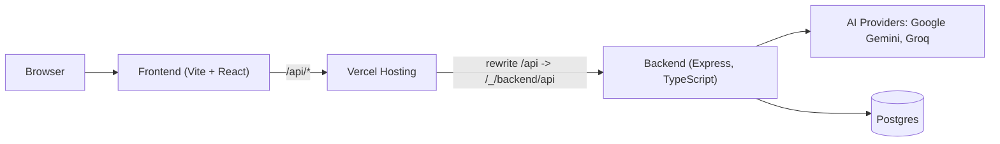

<!-- prettier-ignore -->
# SelamatKerja — KakakSafe

[](https://vercel.com)
[](https://nodejs.org)
[](LICENSE)

Welcome to SelamatKerja — an assistant and marketplace for domestic workers (Kakak). This repository contains both frontend (Vite + React) and backend (Express + TypeScript) code designed to run together on a single Vercel project. The app offers contract analysis, rights Q&A (RAG + LLMs), job matching, and secure user flows.

**Highlights**
- Friendly, simple UI for low-literacy users
- Robust AI integration with provider fallbacks
- Server-side routes and secure secret management via Vercel
- Resilient error handling for offline/limited environments

---

**Architecture**



---

**Tech Stack**

- **Frontend:** Vite, React, TypeScript, Tailwind CSS
- **Backend:** Node.js, Express, TypeScript
- **Database:** PostgreSQL (via `pg`)
- **AI / LLMs:** Google Gemini (via `@google/genai`) with a Groq/OpenAI-compatible fallback (`openai` client)
- **Hosting / Deployment:** Vercel (single-project, frontend + backend)
- **OCR / PDF:** `tesseract.js`, `pdf-parse`

---

**Features**

- Contract analysis: extract key contract terms and provide simple explanations for workers
- Rights Q&A: Retrieval-Augmented Generation (RAG) from a local knowledge base + LLM answers
- Job matching: match job listings to worker preferences with a human-friendly explanation
- Resilient AI handling: multiple API keys, provider fallback, and local fallbacks when providers are unavailable
- Safe deployment: secrets kept in Vercel environment variables; server-side AI calls (no provider keys on the client)


---

**Quick Start — Local (Developer)**

Prerequisites:
- Node.js 18+ and npm
- (Optional) PostgreSQL for local DB testing

1. Install dependencies (root contains `frontend/` and `backend/`):

```bash
# Frontend
cd frontend
npm ci

# Backend
cd ../backend
npm ci
```

2. Backend (dev):

```bash
# Build and run backend (TypeScript -> dist)
cd backend
npm run build
# Run compiled server for local testing
node dist/src/index.js
```

3. Frontend (dev):

```bash
cd frontend
npm run dev
# Open http://localhost:5173 (default Vite port)
```

Notes:
- The frontend uses `import.meta.env.VITE_API_URL` at build time. The project includes a runtime axios fallback so the deployed app will call `/api` if `VITE_API_URL` is not set.

---

**Environment Variables (required in Vercel)**

Set these in your Vercel Project → Settings → Environment Variables (do NOT commit secrets to Git):

- `GEMINI_API_KEY` — comma-separated Gemini API key(s) (used by `@google/genai`).
- `GROQ_API_KEY` — Groq/OpenAI-compatible API key (fallback client).
- `GROQ_BASE_URL` — (optional) defaults to `https://api.groq.com/openai/v1`.
- `GROQ_MODEL` — (optional) model name for Groq fallback.
- `DATABASE_URL` — Postgres connection string used by the backend.
- `JWT_SECRET` — JWT signing secret used for auth.
- `VITE_API_URL` — frontend API base (e.g. `/api` or `/_/backend/api`).

Example (Vercel CLI):

```bash
vercel env add GEMINI_API_KEY production
vercel env add GROQ_API_KEY production
vercel env add DATABASE_URL production
vercel env add VITE_API_URL production
```

---

**Single-Project Vercel Deployment (recommended)**

This repo is configured to run frontend and backend in a single Vercel project using a backend service mounted under the `/_/backend` prefix. Key steps:

1. Ensure `vercel.json` contains the service mapping and rewrite.
2. Add environment variables (see list above).
3. Deploy (either push to the connected branch or run):

```bash
git add .
git commit -m "Ready for Vercel"
git push
# or deploy immediately
vercel --prod
```

4. Test endpoints:

```bash
curl -i https://<your-site>.vercel.app/api/ping
curl -i -X POST https://<your-site>.vercel.app/api/ask -H "Content-Type: application/json" -d '{"question":"hi"}'
```

---

**Troubleshooting — Common Issues & Fixes**

- 500 errors after deploy: often caused by missing `DATABASE_URL` or DB connection refused. Fix: set `DATABASE_URL` in Vercel or rely on the app's DB fallback.
- Frontend calling wrong host: Vite reads `VITE_API_URL` at build time. If you change `VITE_API_URL` in Vercel you must redeploy frontend. The project includes a runtime fallback so `/api` will be used if no value is present.
- AI provider errors (429 / RATE LIMIT or billing): provider returns quota or billing errors. Fix: provide valid API key, add billing, or rely on fallback (Groq or local fallback answers).
- Missing modules at runtime: ensure `package.json` dependencies are present in the service root and Vercel installs them during build.

If you hit a runtime 500 while using the Ask AI flow, gather Vercel function logs and share the stack trace:

```bash
vercel logs <project-name> --prod --limit 200
```

---

**Developer Tips**
- Use the provided test script for quickly reproducing intent and DB paths: [backend/scripts/run_test_ask.js](backend/scripts/run_test_ask.js)
- Keep secrets out of `backend/.env` — use the Vercel Environment Variables UI or CLI instead.

---

**Vercel Postgres & Serverless Pooling**

- If you use Vercel Postgres (recommended), set the `DATABASE_URL` environment variable in Vercel for `Production` and `Preview`.
- Serverless functions can create many connections on cold starts. This repo uses a global cached `pg.Pool` (see `backend/src/db.ts`) so the pool is reused across invocations and reduces connection storms.
- Pattern summary:
  - create `Pool` once and attach to `global` / `globalThis`
  - export that shared pool for queries
  - this prevents many short-lived pools being created on each function call

Example: see `backend/src/db.ts` for the exact implementation used in this project.


**Contributing**

Contributions are welcome. Please open issues or PRs and follow the existing code style. For major changes, open an issue first to discuss.

**License**

MIT — see [LICENSE](LICENSE)

---
